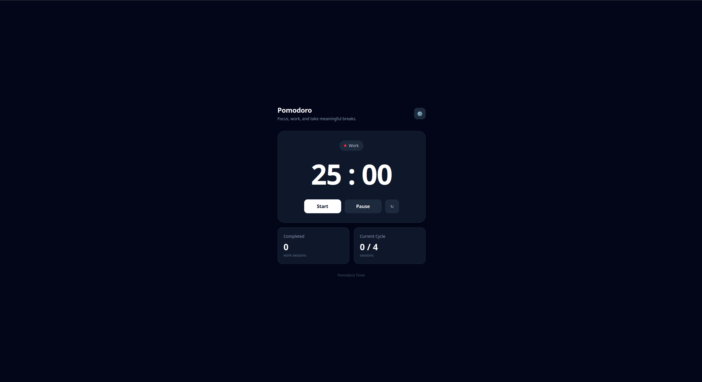

# 🍅 Pomodoro Timer

A sleek, responsive, and lightweight Pomodoro Timer application built with **Vanilla JavaScript**, **HTML5**, and **Tailwind CSS**. It helps users manage focused work sessions with short and long breaks based on the Pomodoro technique.



🔗 Live Demo: https://promodo-pied.vercel.app/


---

## ✨ Features

* 🍅 **Pomodoro Timer**: Run focused work sessions with a countdown timer.
* ▶️ **Start / Resume**: Start the timer or continue from where it was paused.
* ⏸️ **Pause Timer**: Pause the current session without losing the remaining time.
* 🔄 **Reset Timer**: Reset the timer and session statistics.
* 🔢 **Session Tracking**: Tracks the total number of completed work sessions.
* 🔁 **Cycle Tracking**: Tracks the current position within a 4-session cycle.
* ☕ **Short Breaks**: Starts a short break after the first three work sessions.
* 🌴 **Long Breaks**: Starts a long break after the fourth work session.
* ⚙️ **Custom Timer Settings**: Configure work, short break, and long break durations.
* 🎯 **Dynamic Session Type**: Displays the current session type: Work, Short Break, or Long Break.
* 🎨 **Dynamic UI**: Updates the timer, session type, cycle count, and completed sessions dynamically.
* 📱 **Responsive Design**: Optimized for desktop, tablet, and mobile screens.
* ⚡ **Vanilla JavaScript**: Built without React or other JavaScript frameworks.

---

## 🛠️ Tech Stack

* **HTML5**: Semantic document structure and form markup.
* **Tailwind CSS**: Utility-first CSS framework for responsive styling and modern UI design.
* **Vanilla JavaScript (ES6+)**: Timer logic, state management, DOM manipulation, event handling, and session management.
* **DOM API**: Used to read user input, manage application state, and dynamically update the interface.

---

## ⚙️ Functionality

The application uses the Pomodoro technique to divide work into focused sessions followed by breaks.

The default timer configuration is:

* **Work**: 25 minutes
* **Short Break**: 5 minutes
* **Long Break**: 15 minutes
* **Long Break Interval**: Every 4 completed work sessions

The application follows this cycle:

```text
Work 1 → Short Break
Work 2 → Short Break
Work 3 → Short Break
Work 4 → Long Break
```

After the long break, a new cycle begins.

The application tracks:

* **Completed**: The total number of completed work sessions.
* **Current Cycle**: The current work session within the 4-session cycle.

For example:

```text
Completed    Current Cycle
    1           1 / 4
    2           2 / 4
    3           3 / 4
    4           4 / 4
    5           1 / 4
```

---

## 📁 Project Structure

```text
Pomodoro-Timer/
├── assets/
│   ├── js/
│   │   └── app.js              # Timer logic & event handling
│   │
│   └── style/
│       ├── input.css           # Tailwind CSS source file
│       └── output.css          # Compiled CSS stylesheet
│
├── index.html                  # Main HTML document
├── package.json                # Project dependencies & scripts
├── package-lock.json           # Dependency lock file
├── preview.png                 # Project preview image
└── README.md                   # Project documentation
```

---

## 🚀 How It Works

1. Press **Start** to begin the current timer.
2. The countdown decreases every second.
3. Press **Pause** to stop the timer while preserving the remaining time.
4. When a Work session reaches `00:00`, it is counted as a completed work session.
5. The current cycle is incremented.
6. After Work sessions 1–3, a Short Break starts.
7. After Work session 4, a Long Break starts.
8. After the Long Break, the cycle resets and a new Work session begins.
9. Open the Settings panel to customize the timer durations.
10. Press **Reset** to return the timer and session statistics to their initial state.

---

## 🧠 What I Practiced

* DOM selection and manipulation
* Event listeners
* `setInterval()` and `clearInterval()`
* Timer state management
* Start / Pause / Resume functionality
* Conditional logic
* Session and cycle tracking
* Managing application state
* Working with `<input>` elements
* Reading values from DOM elements
* Type conversion using `Number()`
* Updating DOM content dynamically
* Using `classList`
* Functions and function parameters
* Template literals
* Converting minutes to seconds
* Building interactive components with Vanilla JavaScript
* Building responsive interfaces with Tailwind CSS

---

## 📄 License

This project is licensed under the **MIT License**.
